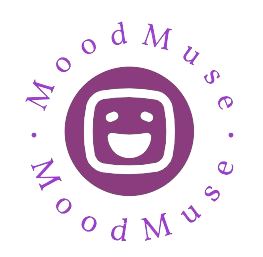

[![Contributors][contributors-shield]][contributors-url]
[![Forks][forks-shield]][forks-url]
[![Stargazers][stars-shield]][stars-url]
[![Issues][issues-shield]][issues-url]
[![MIT License][license-shield]][license-url]
[![LinkedIn][linkedin-shield]](https://www.linkedin.com/in/chater-marzougui-342125299/)

<!-- PROJECT LOGO -->
 

  
    <h1 width="35px">MoodMuse
    </h1>
  

    A Flutter Application for Mood-based Music Recommendations Made for TSYP11 booth Challenge
     
     
    <a href="https://github.com/chater-marzougui/MoodMuse/issues/new?labels=bug&template=bug-report---.md">Report Bug</a>
    ·
    <a href="https://github.com/chater-marzougui/MoodMuse/issues/new?labels=enhancement&template=feature-request---.md">Request Feature</a>
  

<!-- TABLE OF CONTENTS -->

  
Table of Contents

  <ol>
    <li><a href="#about-the-project">About The Project</a></li>
    <li><a href="#installation">Installation</a></li>
    <li><a href="#usage">Usage</a></li>
    <li><a href="#contributing">Contributing</a></li>
    <li><a href="#credits">Credits</a></li>
    <li><a href="#license">License</a></li>
    <li><a href="#contact">Contact</a></li>
  </ol>

<!-- ABOUT THE PROJECT -->
## About The Project
<h3>This Flutter application utilizes the device's camera to capture an image of the user's face. The image is then processed by an AI model hosted on ngrok to analyze the user's mood. Based on the detected mood, the application generates a curated music playlist tailored to enhance the user's emotional state. The seamless integration of camera functionality, AI analysis, and music recommendation makes this app an immersive and personalized experience for users seeking to enhance their mood through music.</h3>
 

    

        
        
        
    

     
    

        
        
        
    

     
    

        
        
    

(<a href="#readme-top">back to top</a>)

## Features

- **Facial Recognition**: MoodMuse utilizes the device's camera to capture the user's facial expression.
- **AI Mood Analysis**: The captured image is processed by an AI model hosted on ngrok to determine the user's mood.
- **Personalized Music Recommendations**: MoodMuse offers a music playlist based on the detected mood, offering users a selection of tracks to enhance their emotional experience.
- **Seamless Integration**: The application seamlessly integrates camera functionality, AI analysis, and music recommendation to provide users with an immersive and personalized experience.

(<a href="#readme-top">back to top</a>)

## Installation

To run MoodMuse locally, follow these steps:

1. Clone the repository: `git clone https://github.com/chater-marzougui/MoodMuse`
2. Navigate to the project directory: `cd MoodMuse`
3. Install dependencies: `flutter pub get`
4. Use your Computer to rub a model on ngrok and fill your credentials in the app **main.dart -> _sendImageToBackend function** 
5. Build the application.
6. Send apk to your phone, and install it.

(<a href="#readme-top">back to top</a>)

## Usage

1. Open MoodMuse on your device.
2. Allow access to the camera when prompted.
3. Capture your facial expression by taking a picture.
4. Wait for MoodMuse to analyze your mood.
5. Enjoy personalized music recommendations based on your mood!

(<a href="#readme-top">back to top</a>)

<!-- CONTRIBUTING -->

## Contributing

Contributions are what make the open source community such an amazing place to learn, inspire, and create. Any contributions you make are **greatly appreciated**.

If you have a suggestion that would make this better, please fork the repo and create a pull request. You can also simply open an issue with the tag "enhancement".
Don't forget to give the project a star! Thanks again!

1. Fork the Project
2. Create your Feature Branch (`git checkout -b feature/AmazingFeature`)
3. Commit your Changes (`git commit -m 'Add some AmazingFeature'`)
4. Push to the Branch (`git push origin feature/AmazingFeature`)
5. Open a Pull Request

(<a href="#readme-top">back to top</a>)

## Credits

MoodMuse was created by Chater Marzougui, Aymen Ktari and Hiba Daoud.

(<a href="#readme-top">back to top</a>)

## License

This project is licensed under the [MIT License](LICENSE).

(<a href="#readme-top">back to top</a>)

<!-- CONTACT -->

## Contact

Chater Marzougui - [@Chater-marzougui](linkedin-url) - chater.mrezgui2002@gmail.com  
Aymen Ktari - [@Aymen-Ktari](https://www.linkedin.com/in/aymen-ktari-469a26246/) - aymen.ktari@supcom.tn  
Hiba Daoud - [@Hiba-Daoud](https://www.linkedin.com/in/hiba-daoud-8598a0245/) - hiba.daoud@supcom.tn

(<a href="#readme-top">back to top</a>)

<!-- MARKDOWN LINKS & IMAGES -->
<!-- https://www.markdownguide.org/basic-syntax/#reference-style-links -->
[contributors-shield]: https://img.shields.io/github/contributors/chater-marzougui/MoodMuse.svg?style=for-the-badge
[contributors-url]: https://github.com/chater-marzougui/MoodMuse/graphs/contributors
[forks-shield]: https://img.shields.io/github/forks/chater-marzougui/MoodMuse.svg?style=for-the-badge
[forks-url]: https://github.com/chater-marzougui/MoodMuse/network/members
[stars-shield]: https://img.shields.io/github/stars/chater-marzougui/MoodMuse.svg?style=for-the-badge
[stars-url]: https://github.com/chater-marzougui/MoodMuse/stargazers
[issues-shield]: https://img.shields.io/github/issues/chater-marzougui/MoodMuse.svg?style=for-the-badge
[issues-url]: https://github.com/chater-marzougui/MoodMuse/issues
[license-shield]: https://img.shields.io/github/license/chater-marzougui/MoodMuse.svg?style=for-the-badge
[license-url]: https://github.com/chater-marzougui/MoodMuse/blob/master/LICENSE.txt
[linkedin-shield]: https://img.shields.io/badge/-LinkedIn-black.svg?style=for-the-badge&logo=linkedin&colorB=555
[linkedin-url]: https://linkedin.com/in/chater-marzougui-342125299
[product-screenshot]: images/screenshot.png
[Next.js]: https://img.shields.io/badge/next.js-000000?style=for-the-badge&logo=nextdotjs&logoColor=white
[Next-url]: https://nextjs.org/
[React.js]: https://img.shields.io/badge/React-20232A?style=for-the-badge&logo=react&logoColor=61DAFB
[React-url]: https://reactjs.org/
[Vue.js]: https://img.shields.io/badge/Vue.js-35495E?style=for-the-badge&logo=vuedotjs&logoColor=4FC08D
[Vue-url]: https://vuejs.org/
[Angular.io]: https://img.shields.io/badge/Angular-DD0031?style=for-the-badge&logo=angular&logoColor=white
[Angular-url]: https://angular.io/
[Svelte.dev]: https://img.shields.io/badge/Svelte-4A4A55?style=for-the-badge&logo=svelte&logoColor=FF3E00
[Svelte-url]: https://svelte.dev/
[Laravel.com]: https://img.shields.io/badge/Laravel-FF2D20?style=for-the-badge&logo=laravel&logoColor=white
[Laravel-url]: https://laravel.com
[Bootstrap.com]: https://img.shields.io/badge/Bootstrap-563D7C?style=for-the-badge&logo=bootstrap&logoColor=white
[Bootstrap-url]: https://getbootstrap.com
[JQuery.com]: https://img.shields.io/badge/jQuery-0769AD?style=for-the-badge&logo=jquery&logoColor=white
[JQuery-url]: https://jquery.com 